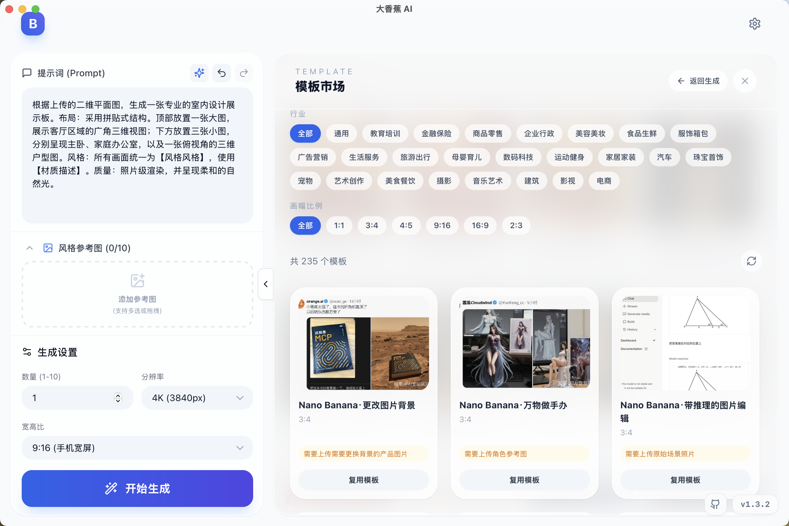
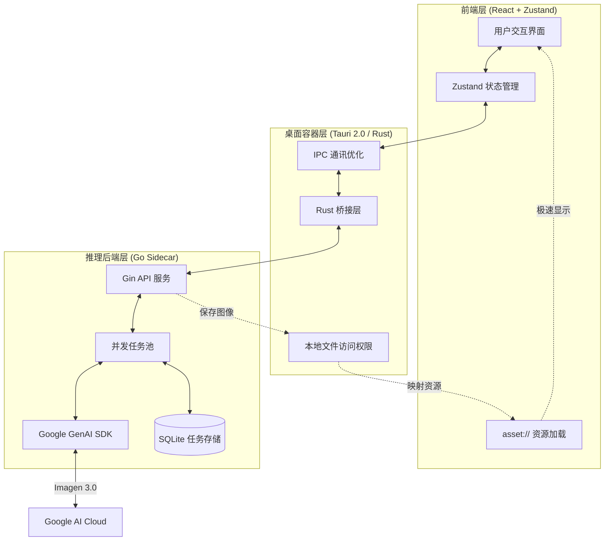

# 🎨 大香蕉 AI (Banana Pro Web & Desktop)

[](https://github.com/ShellMonster/Nano_Banana_Pro_Web/stargazers)
[](https://github.com/ShellMonster/Nano_Banana_Pro_Web/blob/main/LICENSE)
[](https://github.com/ShellMonster/Nano_Banana_Pro_Web/releases)


[English](README_EN.md) | [简体中文](README.md) | [日本語](README_JP.md) | [한국어](README_KR.md)

**大香蕉 AI** 是一款专为创意工作者打造的高性能图片生成平台。它融合 Gemini 与 OpenAI 标准接口能力，支持高分辨率（最高 4K）的文生图与图生图，并提供桌面端与 Web 端两种形态。

<p align="center">
  
  <br>
  
  <br>
  
</p>

> 💡 **近期更新亮点**：
> - **🔍 识图模型独立配置**：新增「识图模型」设置标签页，用于逆向提示词功能，默认继承生图配置。
> - **✨ 图片逆向提示词**：上传参考图后点击「反推提示词」按钮，AI 自动分析图片生成可复用的提示词。
> - **🔒 安全性增强**：图片上传添加 20MB 限制，本地路径读取增加路径遍历防护。
> - **🌐 多语言输出**：逆向提示词支持根据界面语言设置输出对应语言的提示词（中/英/日/韩等 20+ 种语言）。
> - **✨ OpenAI 标准接口对接**：提示词优化 + 生图两条链路可切换 Gemini / OpenAI 兼容接口。
> - **🤖 提示词优化增强**：新增 **JSON 模式** 按钮，支持强制输出结构化 JSON 并自动格式化回填，提升 Prompt 质量。
> - **🧵 模板市场**：下拉打开整版模板市场，支持筛选、预览、来源与技巧提示，一键复用。
> - **🚀 大规模列表性能优化**：历史记录与模板市场改为虚拟列表/虚拟网格，图片加载更顺滑。

> 💡 **推荐使用**：为了获得最佳的生成体验与极高的性价比，推荐搭配 [云雾API](https://yunwu.ai/register?aff=i4hh) 使用。
>
> | 生成分辨率 | [云雾API](https://yunwu.ai/register?aff=i4hh) 价格 | [Google 官方价格 (参考)](https://ai.google.dev/gemini-api/docs/pricing?hl=zh-cn#gemini-3-pro-image-preview) |
> | :--- | :--- | :--- |
> | **1K** (1024x1024) | **0.08 元/张** | ≈ 0.94 元/张 |
> | **2K** (2048x2048) | **0.08 元/张** | ≈ 0.94 元/张 |
> | **4K** (4096x4096) | **0.14 元/张** | ≈ 1.68 元/张 |

---

## 🌟 核心特性

- **🚀 极致性能**：采用 **Tauri 2.0** 架构，配合 **Go 语言** 编写的高并发 Sidecar 后端，资源占用极低。
- **🖼️ 4K 超清创作**：深度优化 Gemini 3.0 模型，支持多种画幅的 4K 超清图像生成。
- **🔌 标准接口兼容**：支持 Gemini(/v1beta) 与 OpenAI(/v1) 标准格式对接，Base URL 与模型可配置。
- **⚡ 自定义协议 (asset://)**：在桌面端注册原生资源协议，绕过 HTTP 协议栈，本地图片加载速度提升 300%。
- **💾 智能历史管理**：内置本地数据库与持久化缓存，支持任务状态自动恢复与大批量历史记录秒开。
- **📸 精准图生图**：支持多参考图输入，提供细腻的风格与构图控制。
- **📦 自动化交付**：集成 GitHub Actions，实现 macOS (Intel/M1) 与 Windows 平台的自动化打包发布。
- **🧩 模板市场**：启动时优先拉取远程模板 JSON，失败自动回退内置模板，并支持模板来源与技巧提示。

---

## 🚀 功能特性详解

### 1. 智能文生图 (Text-to-Image)
- **精准语义理解**：深度集成 Google Gemini 3.0 模型，能够精准捕捉提示词中的细节、风格与氛围。
- **提示词智能优化**：内置 AI 优化引擎，可通过 Gemini / OpenAI 标准接口模型优化提示词。
- **提示词编辑历史**：支持无限次的撤销与重做，方便在不同创意想法间快速切换。
- **批量并发生成**：支持一次性设置生成多达 100 张图片，后台自动排队处理。
- **实时进度追踪**：提供清晰的进度条与状态显示，生成过程中的每一张图片都有对应的占位卡片，完成后自动刷新。

### 2. 强大的图生图 (Image-to-Image)
- **多图参考支持**：最多可同时添加 10 张参考图，帮助 AI 更好地理解您想要的构图或风格。
- **逆向提示词提取**：点击参考图上的「反推提示词」按钮，AI 自动分析图片内容并生成详细的提示词，支持中/英/日/韩等 20+ 种语言输出。
- **灵活的添加方式**：
    - **点击/拖拽**：直接从本地文件夹选取或拖入图片。
    - **粘贴支持**：支持直接从网页或聊天工具复制图片并粘贴到软件中。
- **智能预处理**：自动对超大图片进行压缩优化，并基于 MD5 校验自动过滤重复图片。

### 3. 专业级参数控制
- **多样化画幅选择**：预设 1:1, 16:9, 9:16, 4:3, 2:3 等多种主流比例。
- **画质自定义**：支持从 1K 到 4K 的超清分辨率配置。
- **智能尺寸适配**：系统会自动根据模型特性，将图片尺寸对齐到最佳像素点（8的倍数），确保生成效果最优化。
- **对接方式切换**：设置中可选 `Gemini(/v1beta)` 或 `OpenAI(/v1)`，并分别配置 Base URL / API Key / 模型 ID。

### 4. 极致的交互与管理
- **大图沉浸式预览**：支持全屏查看图片，提供自由缩放与拖拽功能。
- **高密度 UI 设计**：针对生产力场景优化，设置面板高度自适应，信息展示更紧凑。
- **一键快捷操作**：
    - **快速复制**：预览界面提供“复制图片”按钮，点击即可直接粘贴到其他软件中。
    - **批量管理**：支持多选图片进行批量保存或删除。
- **状态智能持久化**：软件会自动记住您的侧边栏状态、窗口位置及最后使用的模型配置。

### 5. 任务与历史记录
- **全自动持久化**：所有生成记录实时保存至本地数据库，重启软件也不丢失。
- **智能搜索**：支持通过关键字快速找回历史任务。
- **稳定连接保障**：自动切换 WebSocket 与 HTTP 轮询模式，确保在复杂网络环境下生成任务不中断。

### 6. 模板市场 (Template Market)
- **海量资源**：目前已收录 **900+** 优质模板，涵盖多种风格与行业。
- **下拉打开**：顶部“拉绳”交互，向下拉出整版模板市场。
- **多维筛选**：支持搜索、渠道/物料/行业/画幅比例筛选。
- **PPT 类目**：标记为 `PPT` 的 16:9 模板会集中展示，便于制作演示稿素材。
- **一键复用**：模板预览后可直接应用（会替换当前 Prompt 与参考图）。
- **手动刷新**：右侧刷新按钮可手动拉取最新模板。
- **来源与技巧**：模板可携带 `tips` 使用提示与 `source` 来源信息（可点击跳转外部浏览器）。
- **参考图要求**：模板可携带 `requirements.note` / `requirements.minRefs`，用于提示需要补充的参考图数量与说明。
- **远程同步**：启动时优先拉取 GitHub Raw 模板 JSON，失败自动回退内置模板并使用本地缓存。

---

## 🧩 模板贡献指南

模板数据统一维护在：

- `backend/internal/templates/assets/templates.json`

### 顶层结构
```json
{
  "meta": {
    "version": "2024.12.01",
    "updated_at": "2024-12-01T12:00:00Z",
    "channels": ["社群发圈", "小红书"],
    "materials": ["海报", "PPT", "封面"],
    "industries": ["教育培训", "生活服务"],
    "ratios": ["1:1", "3:4", "16:9"]
  },
  "items": []
}
```

### 基本字段（单条模板）
```json
{
  "id": "tpl-001",
  "title": "猫表情包模板",
  "channels": ["社群发圈", "娱乐"],
  "materials": ["海报"],
  "industries": ["生活服务"],
  "ratio": "1:1",
  "preview": "https://.../thumb.jpg",
  "image": "https://.../full.jpg",
  "prompt": "可选：模板提示词...",
  "prompt_params": "可选：提示词使用说明（保留字段）",
  "tips": "可选：模板使用提示/技巧",
  "source": {
    "name": "@贡献者",
    "label": "GitHub",
    "icon": "github",
    "url": "https://example.com/templates/tpl-001"
  },
  "requirements": { "minRefs": 2, "note": "还需要一张猫照片作为参考" },
  "tags": ["猫", "表情", "搞笑"]
}
```

### 字段补充说明
- `requirements.note`：当需要补充参考图时的提示文案，会在卡片与预览中提示。
- `requirements.minRefs`：要求的最少参考图数量。
- `tips`：模板使用技巧/注意事项（预览页展示）。
- `prompt_params`：提示词使用说明（保留字段，不参与渲染）。
- `tags`：用于检索与聚合展示。
- `materials`：可加入 `PPT` 标签（建议 16:9 模板），以便筛选演示稿素材。
- `meta.version / meta.updated_at`：用于模板版本标记与缓存比对。

### source.icon 预置关键字
- `github` GitHub
- `xhs` 小红书
- `wechat` 微信/公众号
- `shop` 电商素材
- `video` 短视频
- `print` 线下印刷
- `gov` 政务媒体
- `meme` 表情包
- `finance` 金融
- `food` 美食
- `local` 本地/生活服务

> 也可以直接传图片 URL，前端会当作 icon 显示。
>
> `preview` / `image` 允许为空：前端会显示默认占位图，仍支持复用 Prompt。
>
> `prompt_params` 当前不参与渲染，仅作为说明保留字段。

### 提交方式
1. Fork 仓库并修改 `backend/internal/templates/assets/templates.json`
2. 提交 PR
3. 合并后客户端启动会从 GitHub Raw 拉取最新模板

> 请确保素材来源合法且链接稳定，避免失效。

## 🏗️ 技术架构

### 核心系统流程图


项目采用“三层架构”设计，确保了性能与扩展性的平衡：

1. **前端 (React + Zustand)**：负责响应式 UI 与状态管理，提供流畅的用户交互。
2. **桌面容器 (Tauri)**：作为 Rust 桥梁，处理窗口控制、本地资源访问及 Sidecar 进程管理。
3. **推理引擎 (Go Sidecar)**：负责与 Google GenAI SDK 通讯，处理 Worker 任务池与本地图片存储。

### 核心优化点
- **IPC 负荷优化**：前端与后端之间仅传递文件路径，大型二进制数据通过 `asset://` 协议直接由前端读取。
- **进程生命周期管理**：Tauri 退出时自动清理 Go 边车进程，防止系统资源泄漏。

---

## 📂 项目结构

```bash
├── backend/            # Go 语言编写的推理后端 (Sidecar)
│   ├── cmd/server/     # 服务入口
│   └── internal/       # 核心逻辑 (Gemini 适配器、Worker 池、数据库)
├── desktop/            # Tauri 桌面端项目 (React + Rust)
│   ├── src/            # 前端组件与业务逻辑
│   └── src-tauri/      # Rust 容器配置与系统权限定义
├── frontend/           # 独立 Web 版前端 (保留参考)
└── assets/             # 项目展示资源 (预览图等)
```

---

## 💻 开发者指南

### 1. 环境准备
- **Go**: 1.21+
- **Node.js**: 18+ (建议使用 20)
- **Rust**: 1.75+ (Tauri 构建必备)

## 🍎 macOS 打开提示异常

部分 macOS 用户下载应用后会因为系统的 Gatekeeper 安全机制导致无法打开或提示异常。可在终端执行以下命令移除隔离标记：

```
sudo xattr -r -d com.apple.quarantine "/Applications/大香蕉 AI.app"
```
- **Google Gemini API Key** (用于 Gemini 对接方式)
- **OpenAI API Key** (用于 OpenAI 对接方式，可选)

### 2. 后端开发
```bash
cd backend
# 复制并配置 config.yaml 填入您的 API Key
go run cmd/server/main.go
```

或者使用 Makefile 快捷命令：
```bash
make build    # 编译后端
make run      # 运行后端
```

### 3. 桌面端开发
```bash
cd desktop
npm install
npm run tauri dev
```

### 4. Web 前端开发
```bash
cd frontend
npm install
npm run dev
```

### 5. 自动化构建 (GitHub Actions)
只需推送带有版本号的标签（如 `v1.3.0`），即可触发自动化构建：
```bash
git tag v1.3.0
git push origin v1.3.0
```

> **注意**：v1.3.0 之后支持通过推送 Tag 自动生成 Release 并上传多平台二进制文件。

### 6. 自动更新 (Updater)
项目已集成 Tauri 官方 Updater 插件，发布新版本后用户启动应用会收到更新提示，可一键下载安装。

1) 生成 Updater 签名密钥（仅需一次，务必妥善保存私钥）
```bash
cd desktop
npm run tauri signer generate -- -w ~/.tauri/banana-updater.key
```

2) 将公钥写入配置：`desktop/src-tauri/tauri.conf.json` 的 `plugins.updater.pubkey`（公钥内容来自 `~/.tauri/banana-updater.key.pub`）

示例（只填入 `.pub` 文件里的 key 内容，不要把私钥提交到仓库）：
```json
{
  "plugins": {
    "updater": {
      "pubkey": "YOUR_PUBLIC_KEY_HERE"
    }
  }
}
```

3) 配置 GitHub Secrets（用于 CI 生成 `*.sig` 与 `latest.json`）

GitHub Secrets 指的是 GitHub 仓库页面里的 Actions Secrets：`Repo -> Settings -> Secrets and variables -> Actions -> New repository secret`

- `TAURI_SIGNING_PRIVATE_KEY`: 私钥文件内容（`~/.tauri/banana-updater.key` 的全文内容，不是文件路径；不要提交到仓库）
- `TAURI_SIGNING_PRIVATE_KEY_PASSWORD`: 私钥密码（如生成时设置了密码，否则可不配置）

本地取私钥内容（示例）：
```bash
cat ~/.tauri/banana-updater.key
```

4) 触发发布后，Release Assets 中应包含 `latest.json`、对应平台安装包，以及同名的 `*.sig` 文件。

---

## ⚙️ 核心配置

| 配置项 | 描述 |
| :--- | :--- |
| `AI对接方式` | `Gemini(/v1beta)` 或 `OpenAI(/v1)`；不同模式使用不同的 Base URL 与模型。 |
| `API Base / API Key` | 兼容标准 OpenAI 格式接口，可替换成任意兼容平台。 |
| `生图模型` | 用于生成图片的主模型。 |
| `识图模型` | 用于逆向提示词功能，分析图片并生成提示词。默认继承生图配置的 Base URL 和 API Key。 |
| `对话模型` | 用于提示词优化功能。 |
| `Storage Dir` | 应用默认将图片保存在系统的 `AppData` (Win) 或 `Application Support` (Mac) 目录下。 |
| `Templates Remote URL` | 远程模板 JSON 地址（默认 GitHub Raw），启动时会拉取并缓存。 |
| `asset://` | 自定义资源协议，用于安全、快速地访问本地生成的图片。 |

> **提示**：OpenAI 类型接口通常要求生图模型（model_id）必填；Gemini 类型需使用 `/v1beta` 路径。
>
> **注意**：OpenAI 对接方式当前仅支持 1K 图片生成（具体取决于所用兼容接口）。

---

## 🐳 Docker 部署（Web 版）

桌面版不适合 Docker 运行，以下仅用于 **后端 + Web 前端** 的部署。

项目提供完整的 Docker 部署方案，支持一键启动、国内镜像源加速、数据持久化等功能。

### 快速开始

```bash
# 1. 复制环境变量模板并配置 API Key
cp .env.example .env
nano .env  # 填入你的 GEMINI_API_KEY 或 OPENAI_API_KEY

# 2. 启动服务（必须使用 docker compose）
docker compose -p banana-pro up -d

# 3. 访问应用
# 浏览器打开：http://localhost:8090
```

### 国内用户加速

如果构建或拉取镜像较慢，可在 `.env` 文件中启用镜像源：

```bash
# .env 文件
DOCKER_REGISTRY=docker.1ms.run/
NPM_REGISTRY=https://registry.npmmirror.com/
GO_PROXY=https://goproxy.cn,direct
```

### 详细文档

完整的部署指南、配置说明、故障排查请查看：**[DOCKER_DEPLOY.md](DOCKER_DEPLOY.md)**

### 主要特性

- 🐳 **多阶段构建**：前端（Node.js）+ 后端（Go）+ 运行时（Alpine + Nginx）
- 🚀 **环境自动检测**：后端自动识别 Docker 环境，监听 `0.0.0.0`（Tauri 监听 `127.0.0.1`）
- 💾 **数据持久化**：图片存储和数据库自动挂载到 `./data/storage`
- 🔄 **健康检查**：内置健康检查接口，自动重启异常容器
- 🇨🇳 **镜像源支持**：通过 Build Args 配置国内镜像源，保持 Dockerfile 通用性

---

## 🤝 贡献与反馈

我们欢迎任何形式的贡献！如果您在使用过程中遇到问题，请通过 GitHub Issue 提交。

- **反馈 Bug**：提供详细的复现步骤与系统环境。
- **提交 PR**：请遵循现有的代码风格，并在提交前进行充分测试。

---

## 📄 开源协议

本项目采用 [MIT License](LICENSE) 协议开源。

---

## 📈 Star History

[](https://star-history.com/#ShellMonster/Nano_Banana_Pro_Web&Date)

---

## 🙏 特别鸣谢

- 本项目中的许多优质模板复用了来自 [awesome-nanobananapro-prompts](https://github.com/xianyu110/awesome-nanobananapro-prompts) 仓库的精选提示词，感谢原作者的无私分享！
- 项目中的 JSON 提示词优化参考了 [fofr](https://gist.github.com/fofr/eec0dae326243321c645aceba28c6119) 的优秀设计，在此表示感谢！
