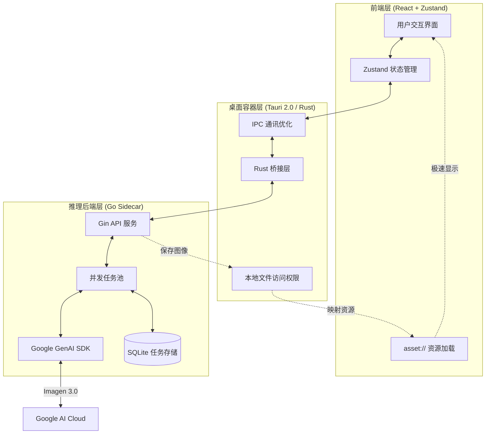

# 🎨 大香蕉 AI (Banana Pro Web & Desktop)

<p align="center">
  
  <br>
  
</p>

[](https://github.com/ShellMonster/Nano_Banana_Pro_Web/stargazers)
[](https://github.com/ShellMonster/Nano_Banana_Pro_Web/blob/main/LICENSE)
[](https://github.com/ShellMonster/Nano_Banana_Pro_Web/releases)


**大香蕉 AI** 是一款专为创意工作者打造的高性能图片生成平台。它完美融合了 Google Gemini 的强大 AI 能力与桌面端的原生性能，支持高分辨率（最高 4K）的文生图与图生图功能。

> 💡 **推荐使用**：为了获得最佳的生成体验与极高的性价比，推荐搭配 [云雾API](https://yunwu.ai/register?aff=i4hh) 使用。
>
> | 生成分辨率 | [云雾API](https://yunwu.ai/register?aff=i4hh) 价格 | [Google 官方价格 (参考)](https://ai.google.dev/gemini-api/docs/pricing?hl=zh-cn#gemini-3-pro-image-preview) |
> | :--- | :--- | :--- |
> | **1K** (1024x1024) | **0.08 元/张** | ≈ 0.94 元/张 |
> | **2K** (2048x2048) | **0.08 元/张** | ≈ 0.94 元/张 |
> | **4K** (4096x4096) | **0.14 元/张** | ≈ 1.68 元/张 |

---

## 🌟 核心特性

- **🚀 极致性能**：采用 **Tauri 2.0** 架构，配合 **Go 语言** 编写的高并发 Sidecar 后端，资源占用极低。
- **🖼️ 4K 超清创作**：深度优化 Gemini 3.0 模型，支持多种画幅的 4K 超清图像生成。
- **⚡ 自定义协议 (asset://)**：在桌面端注册原生资源协议，绕过 HTTP 协议栈，本地图片加载速度提升 300%。
- **💾 智能历史管理**：内置本地数据库与持久化缓存，支持任务状态自动恢复与大批量历史记录秒开。
- **📸 精准图生图**：支持多参考图输入，提供细腻的风格与构图控制。
- **📦 自动化交付**：集成 GitHub Actions，实现 macOS (Intel/M1) 与 Windows 平台的自动化打包发布。

---

## 🚀 功能特性详解

### 1. 智能文生图 (Text-to-Image)
- **精准语义理解**：深度集成 Google Gemini 3.0 模型，能够精准捕捉提示词中的细节、风格与氛围。
- **批量并发生成**：支持一次性设置生成多达 100 张图片，后台自动排队处理。
- **实时进度追踪**：提供清晰的进度条与状态显示，生成过程中的每一张图片都有对应的占位卡片，完成后自动刷新。

### 2. 强大的图生图 (Image-to-Image)
- **多图参考支持**：最多可同时添加 10 张参考图，帮助 AI 更好地理解您想要的构图或风格。
- **灵活的添加方式**：
    - **点击/拖拽**：直接从本地文件夹选取或拖入图片。
    - **粘贴支持**：支持直接从网页或聊天工具复制图片并粘贴到软件中。
- **智能预处理**：自动对超大图片进行压缩优化，并基于 MD5 校验自动过滤重复图片。

### 3. 专业级参数控制
- **多样化画幅选择**：预设 1:1, 16:9, 9:16, 4:3, 2:3 等多种主流比例。
- **画质自定义**：支持从 1K 到 4K 的超清分辨率配置。
- **智能尺寸适配**：系统会自动根据模型特性，将图片尺寸对齐到最佳像素点（8的倍数），确保生成效果最优化。

### 4. 极致的交互与管理
- **大图沉浸式预览**：支持全屏查看图片，提供自由缩放与拖拽功能。
- **一键快捷操作**：
    - **快速复制**：预览界面提供“复制图片”按钮，点击即可直接粘贴到其他软件中。
    - **批量管理**：支持多选图片进行批量保存或删除。
- **侧边栏状态持久化**：软件会自动记住您的侧边栏展开/收起状态。

### 5. 任务与历史记录
- **全自动持久化**：所有生成记录实时保存至本地数据库，重启软件也不丢失。
- **智能搜索**：支持通过关键字快速找回历史任务。
- **稳定连接保障**：自动切换 WebSocket 与 HTTP 轮询模式，确保在复杂网络环境下生成任务不中断。

---

## 🏗️ 技术架构

### 核心系统流程图


项目采用“三层架构”设计，确保了性能与扩展性的平衡：

1. **前端 (React + Zustand)**：负责响应式 UI 与状态管理，提供流畅的用户交互。
2. **桌面容器 (Tauri)**：作为 Rust 桥梁，处理窗口控制、本地资源访问及 Sidecar 进程管理。
3. **推理引擎 (Go Sidecar)**：负责与 Google GenAI SDK 通讯，处理 Worker 任务池与本地图片存储。

### 核心优化点
- **IPC 负荷优化**：前端与后端之间仅传递文件路径，大型二进制数据通过 `asset://` 协议直接由前端读取。
- **进程生命周期管理**：Tauri 退出时自动清理 Go 边车进程，防止系统资源泄漏。

---

## 📂 项目结构

```bash
├── backend/            # Go 语言编写的推理后端 (Sidecar)
│   ├── cmd/server/     # 服务入口
│   └── internal/       # 核心逻辑 (Gemini 适配器、Worker 池、数据库)
├── desktop/            # Tauri 桌面端项目 (React + Rust)
│   ├── src/            # 前端组件与业务逻辑
│   └── src-tauri/      # Rust 容器配置与系统权限定义
├── frontend/           # 独立 Web 版前端 (保留参考)
└── assets/             # 项目展示资源 (预览图等)
```

---

## 💻 开发者指南

### 1. 环境准备
- **Go**: 1.21+
- **Node.js**: 18+ (建议使用 20)
- **Rust**: 1.75+ (Tauri 构建必备)
- **Google Gemini API Key**

### 2. 后端开发
```bash
cd backend
# 复制并配置 config.yaml 填入您的 API Key
go run cmd/server/main.go
```

### 3. 桌面端开发
```bash
cd desktop
npm install
npm run tauri dev
```

### 4. 自动化构建 (GitHub Actions)
只需推送带有版本号的标签（如 `v0.1.3`），即可触发自动化构建：
```bash
git tag v0.1.3
git push origin v0.1.3
```

### 5. 自动更新 (Updater)
项目已集成 Tauri 官方 Updater 插件，发布新版本后用户启动应用会收到更新提示，可一键下载安装。

1) 生成 Updater 签名密钥（仅需一次，务必妥善保存私钥）
```bash
cd desktop
npm run tauri signer generate -- -w ~/.tauri/banana-updater.key
```

2) 将公钥写入配置：`desktop/src-tauri/tauri.conf.json` 的 `plugins.updater.pubkey`（公钥内容来自 `~/.tauri/banana-updater.key.pub`）

示例（只填入 `.pub` 文件里的 key 内容，不要把私钥提交到仓库）：
```json
{
  "plugins": {
    "updater": {
      "pubkey": "YOUR_PUBLIC_KEY_HERE"
    }
  }
}
```

3) 配置 GitHub Secrets（用于 CI 生成 `*.sig` 与 `latest.json`）

GitHub Secrets 指的是 GitHub 仓库页面里的 Actions Secrets：`Repo -> Settings -> Secrets and variables -> Actions -> New repository secret`

- `TAURI_SIGNING_PRIVATE_KEY`: 私钥文件内容（`~/.tauri/banana-updater.key` 的全文内容，不是文件路径；不要提交到仓库）
- `TAURI_SIGNING_PRIVATE_KEY_PASSWORD`: 私钥密码（如生成时设置了密码，否则可不配置）

本地取私钥内容（示例）：
```bash
cat ~/.tauri/banana-updater.key
```

4) 触发发布后，Release Assets 中应包含 `latest.json`、对应平台安装包，以及同名的 `*.sig` 文件。

---

## ⚙️ 核心配置

| 配置项 | 描述 |
| :--- | :--- |
| `Gemini API Key` | 决定了 AI 生成的配额，请在应用设置或配置文件中填入。 |
| `Storage Dir` | 应用默认将图片保存在系统的 `AppData` (Win) 或 `Application Support` (Mac) 目录下。 |
| `asset://` | 自定义资源协议，用于安全、快速地访问本地生成的图片。 |

---

## 🤝 贡献与反馈

我们欢迎任何形式的贡献！如果您在使用过程中遇到问题，请通过 GitHub Issue 提交。

- **反馈 Bug**：提供详细的复现步骤与系统环境。
- **提交 PR**：请遵循现有的代码风格，并在提交前进行充分测试。

---

## 📄 开源协议

本项目采用 [MIT License](LICENSE) 协议开源。

---

## 📈 Star History

[](https://star-history.com/#ShellMonster/Nano_Banana_Pro_Web&Date)
