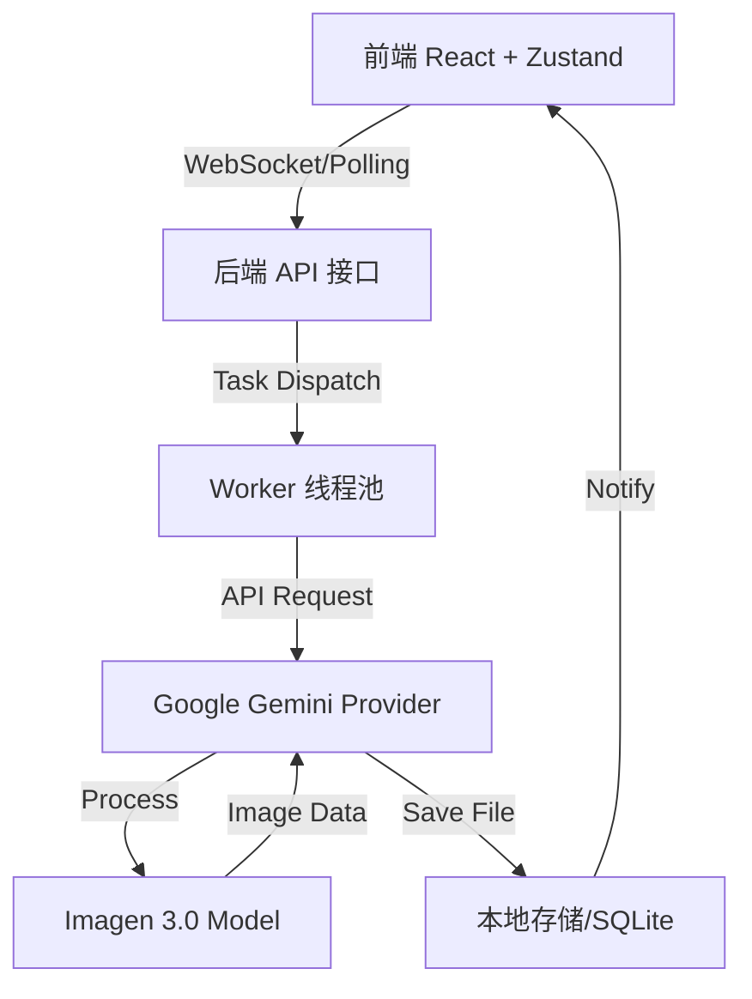

# 大香蕉图片生成工具 (Banana Pro Web)

<p align="center">
  
</p>


大香蕉图片生成工具 是一个高性能、易扩展的批量图片生成平台，专为创意工作者设计。它基于 Google Gemini API，支持高分辨率（最高 4K）的文生图与图生图功能，并提供直观的批量任务管理界面。

## 🌟 核心特性

- **🚀 极速生成**：基于 Go 语言后端与 Worker 池化技术，支持多任务并发处理。
- **🎨 4K 超清支持**：深度优化 Gemini 3.0 模型参数，支持多种画幅的 4K 超清生成。
- **📸 智能图生图**：支持多张参考图输入，精准控制生成风格与内容。
- **📦 批量处理**：一键开启批量生成模式，实时进度监控。
- **💾 历史记录管理**：完整的任务历史追踪，支持失败任务重试与本地缓存恢复。
- **🔌 灵活扩展**：模块化 Provider 设计，可轻松接入其他主流 AI 模型。

## 🏗️ 技术架构

### 核心流程图


### 关键设计
- **任务调度系统**：采用并发安全的 Worker 池，有效平衡服务器负载，防止大批量请求导致的系统崩溃。
- **多级缓存策略**：前端采用 Zustand 内存缓存，后端采用 SQLite 持久化存储，确保任务状态在刷新后仍能恢复。
- **响应式 UI**：基于 Tailwind CSS 构建的三栏式布局，完美适配不同尺寸的显示器。

## 💻 技术栈

| 模块 | 技术 | 描述 |
| :--- | :--- | :--- |
| **后端** | Go v1.24.3 | 高性能并发处理 |
| **API** | Gin v1.11.0 | 灵活的 RESTful 路由 |
| **模型** | Google GenAI SDK | 深度对接 Imagen 3.0 |
| **数据库** | SQLite + GORM | 轻量级 ORM 数据存储 |
| **前端** | React v18.3.1 | 组件化界面开发 |
| **状态** | Zustand v5.0.2 | 极简响应式状态流 |
| **样式** | Tailwind CSS | 原子化现代样式系统 |

## 🚀 快速启动

### 1. 环境准备
- Go 1.22+
- Node.js 18+
- Google Gemini API Key

### 2. 后端配置
```bash
cd backend
# 编辑配置文件 configs/config.yaml，填入 providers.gemini.api_key
go run cmd/server/main.go
```

### 3. 前端启动
```bash
cd frontend
npm install
npm run dev
```

## ⚙️ 核心配置项

| 配置项 | 描述 | 示例 |
| :--- | :--- | :--- |
| `providers.gemini.api_key` | Gemini API 密钥 | `AIzaSy...` |
| `storage.local_dir` | 图片存储路径 | `storage/local` |
| `VITE_API_URL` | 前端 API 基础路径 | `http://localhost:8080/api/v1` |

## �️ 功能路线图 (Roadmap)

- [x] **v1.0.0**: 核心功能发布，支持 4K 文生图与批量生成。
- [x] **v1.1.0**: 深度集成图生图（Image-to-Image）逻辑。
- [ ] **v1.2.0**: 支持多模型对比生成模式。
- [ ] **v1.3.0**: 增加图片在线编辑（Canvas）与局部重绘功能。
- [ ] **v2.0.0**: 接入更多主流 Provider（如 Midjourney, Flux）。

## 🤝 参与贡献

我们欢迎任何形式的贡献，包括但不限于：
1. **反馈 Bug**：通过 GitHub Issue 提交。
2. **提交代码**：请遵循现有的代码风格，并提交 Pull Request。
3. **完善文档**：帮助修正错别字或增加使用技巧。

## 📄 开源协议
本项目采用 [MIT License](LICENSE) 协议开源。
