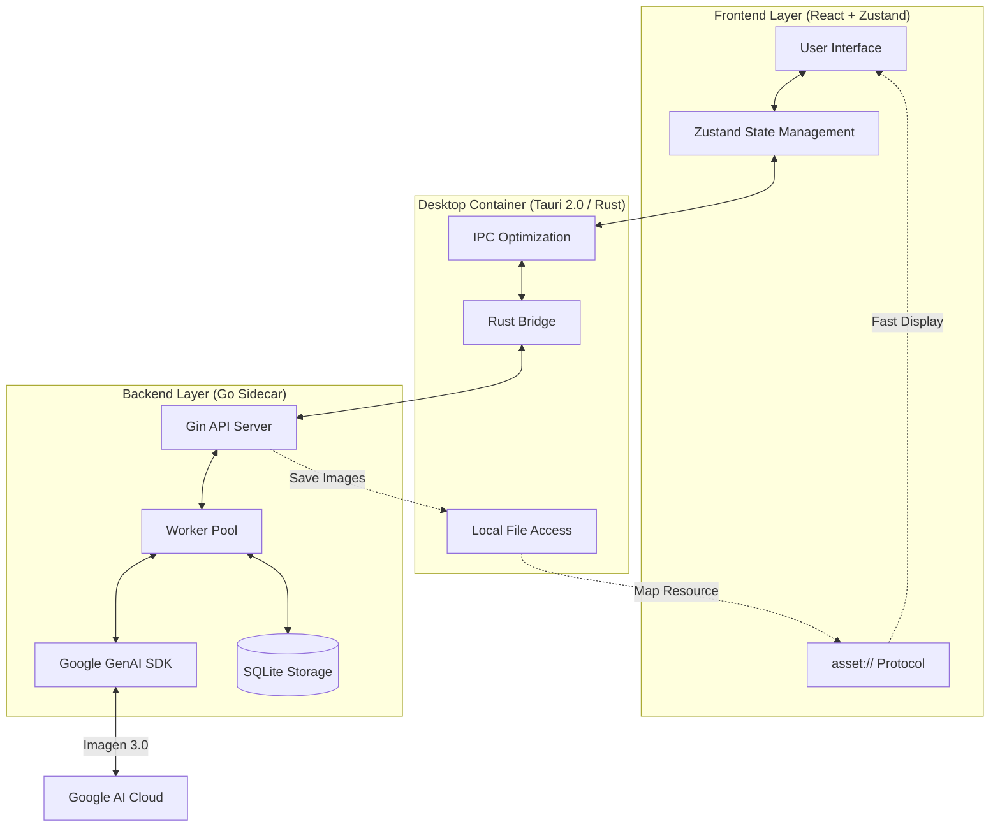

# 🎨 Banana Pro AI (Web & Desktop)

[](https://github.com/ShellMonster/Nano_Banana_Pro_Web/stargazers)
[](https://github.com/ShellMonster/Nano_Banana_Pro_Web/blob/main/LICENSE)
[](https://github.com/ShellMonster/Nano_Banana_Pro_Web/releases)


[English](README_EN.md) | [简体中文](README.md) | [日本語](README_JP.md) | [한국어](README_KR.md)

**Banana Pro AI** is a high-performance image generation platform designed for creative professionals. It integrates Gemini and OpenAI standard API capabilities, supporting high-resolution (up to 4K) text-to-image and image-to-image generation, available in both Desktop and Web formats.

> [!NOTE]
> **The application supports English internally and allows language switching in the settings.**

<p align="center">
  
  <br>
  
  <br>
  
</p>

> 💡 **Recent Highlights**:
> - **✨ OpenAI Standard API Integration**: Switch between Gemini / OpenAI compatible interfaces for both prompt optimization and image generation.
> - **🤖 Enhanced Prompt Optimization**: New **JSON Mode** button, supporting structured JSON output with automatic formatting and backfilling for better prompt quality.
> - **🧵 Template Market**: Pull-down to open a full-screen template market with filtering, previewing, source tracking, and usage tips.
> - **🚀 Performance Optimization**: History records and template market migrated to virtual lists/grids for smoother image loading.
> - **🖼️ No-Image Template Support**: Automatically shows a placeholder when a template lacks a preview image, while still allowing Prompt reuse.

> 💡 **Recommended**: For the best generation experience and cost-effectiveness, we recommend using [Yunwu API](https://yunwu.ai/register?aff=i4hh).
>
> | Resolution | [Yunwu API](https://yunwu.ai/register?aff=i4hh) Price | [Google Official Price (Ref)](https://ai.google.dev/gemini-api/docs/pricing?hl=zh-cn#gemini-3-pro-image-preview) |
> | :--- | :--- | :--- |
> | **1K** (1024x1024) | **¥0.08 / Image** | ≈ ¥0.94 / Image |
> | **2K** (2048x2048) | **¥0.08 / Image** | ≈ ¥0.94 / Image |
> | **4K** (4096x4096) | **¥0.14 / Image** | ≈ ¥1.68 / Image |

---

## 🌟 Key Features

- **🚀 Extreme Performance**: Built with **Tauri 2.0** architecture and a high-concurrency Sidecar backend written in **Go**, ensuring extremely low resource usage.
- **🖼️ 4K Ultra-HD Creation**: Deeply optimized Gemini 3.0 model, supporting 4K UHD generation across multiple aspect ratios.
- **🔌 Standard API Compatibility**: Supports Gemini (/v1beta) and OpenAI (/v1) standard formats with configurable Base URL and Model ID.
- **⚡ Custom Protocol (asset://)**: Registered native resource protocol for desktop, bypassing the HTTP stack to increase local image loading speed by 300%.
- **💾 Smart History Management**: Built-in local database and persistent caching, supporting task recovery and instant opening of large history records.
- **📸 Precise Image-to-Image**: Supports multiple reference images with fine-grained style and composition control.
- **📦 Automated Delivery**: Integrated GitHub Actions for automated packaging and releasing on macOS (Intel/M1) and Windows.
- **🧩 Template Market**: Prioritizes pulling remote template JSON on startup with automatic fallback to built-in templates.

---

## 🚀 Functional Details

### 1. Smart Text-to-Image
- **Precise Semantic Understanding**: Deep integration with Google Gemini 3.0, capturing fine details, styles, and moods from prompts.
- **AI Prompt Optimization**: Built-in optimization engine via Gemini / OpenAI standard interfaces.
- **Edit History**: Supports infinite undo/redo for quick switching between creative ideas.
- **Batch Processing**: Set up to 100 images for batch generation with background queue processing.
- **Real-time Tracking**: Clear progress bars and status displays with placeholder cards for each image.

### 2. Powerful Image-to-Image
- **Multi-Ref Support**: Add up to 10 reference images to help the AI understand desired composition or style.
- **Flexible Uploads**: 
    - **Click/Drag**: Select from local folders or drag-and-drop.
    - **Clipboard Support**: Paste images directly from the web or chat tools.
- **Smart Preprocessing**: Automatic compression for oversized images and MD5-based duplicate filtering.

### 3. Professional Parameter Control
- **Aspect Ratios**: Preset ratios including 1:1, 16:9, 9:16, 4:3, 2:3.
- **Quality Settings**: Customizable resolution from 1K to 4K.
- **Smart Sizing**: Automatically aligns image dimensions to 8-pixel boundaries for optimal model performance.
- **Interface Switching**: Toggle between `Gemini(/v1beta)` and `OpenAI(/v1)` modes in settings.

### 4. Advanced UX & Management
- **Immersive Preview**: Full-screen view with free zooming and dragging.
- **High-Density UI**: Optimized for productivity with adaptive sidebars and compact info displays.
- **Quick Actions**:
    - **Fast Copy**: One-click "Copy Image" button in preview for easy pasting into other apps.
    - **Batch Management**: Multi-select images for batch saving or deletion.
- **Smart Persistence**: Remembers sidebar state, window position, and last-used model configurations.

### 5. Task & History
- **Auto Persistence**: Real-time saving to local database to prevent data loss.
- **Smart Search**: Quickly find historical tasks via keywords.
- **Stable Connection**: Automatically switches between WebSocket and HTTP polling for uninterrupted generation in complex networks.

### 6. Template Market
- **Huge Resource**: 900+ high-quality templates across various styles and industries.
- **Pull-down Access**: Interactive "rope" pull-down to open the market.
- **Multi-dim Filtering**: Filter by Search, Channel, Material, Industry, or Aspect Ratio.
- **PPT Category**: Dedicated section for 16:9 templates suitable for presentation materials.
- **One-click Reuse**: Directly apply templates (replaces current Prompt and reference images).
- **Manual Sync**: Refresh button to pull latest templates manually.
- **Source & Tips**: Includes usage `tips` and clickable `source` links.
- **Ref Requirements**: Displays `minRefs` and `note` for required reference images.
- **Remote Sync**: Prioritizes GitHub Raw JSON with local caching.

---

## 🧩 Template Contribution Guide

Template data is maintained in:
- `backend/internal/templates/assets/templates.json`

### Top-level Structure
```json
{
  "meta": {
    "version": "2024.12.01",
    "updated_at": "2024-12-01T12:00:00Z",
    "channels": ["Community", "Social", "Xiaohongshu"],
    "materials": ["Poster", "PPT", "Cover"],
    "industries": ["Education", "Life Services"],
    "ratios": ["1:1", "3:4", "16:9"]
  },
  "items": []
}
```

### Basic Fields (Single Template)
```json
{
  "id": "tpl-001",
  "title": "Cat Meme Template",
  "channels": ["Community", "Entertainment"],
  "materials": ["Poster"],
  "industries": ["Life Services"],
  "ratio": "1:1",
  "preview": "https://.../thumb.jpg",
  "image": "https://.../full.jpg",
  "prompt": "Optional: Template prompt...",
  "prompt_params": "Optional: Prompt usage instructions (reserved)",
  "tips": "Optional: Usage tips/tricks",
  "source": {
    "name": "@Contributor",
    "label": "GitHub",
    "icon": "github",
    "url": "https://example.com/templates/tpl-001"
  },
  "requirements": { "minRefs": 2, "note": "Requires one cat photo as reference" },
  "tags": ["cat", "meme", "funny"]
}
```

### Field Explanation
- `requirements.note`: Prompt text when reference images are needed.
- `requirements.minRefs`: Minimum number of reference images required.
- `tips`: Usage tips/notes (displayed in preview).
- `prompt_params`: Prompt usage instructions (reserved field, not rendered).
- `tags`: For searching and aggregation.
- `materials`: Can include `PPT` tag (suggested for 16:9) for presentation filtering.
- `meta.version / meta.updated_at`: For versioning and cache comparison.

### source.icon Presets
- `github`, `xhs`, `wechat`, `shop`, `video`, `print`, `gov`, `meme`, `finance`, `food`, `local`.

---

## 🏗️ Technical Architecture

### Core Flow


The project uses a "three-layer architecture" to balance performance and scalability:
1. **Frontend (React + Zustand)**: Handles responsive UI and state management.
2. **Desktop Container (Tauri)**: Acts as a Rust bridge for window control and local resource access.
3. **Inference Engine (Go Sidecar)**: Communicates with Google GenAI SDK and manages task pools.

### Core Optimizations
- **IPC Load Optimization**: Only file paths are passed between frontend and backend; large binary data is read directly via the `asset://` protocol.
- **Lifecycle Management**: Automatically cleans up Go sidecar processes when Tauri exits.

---

## 📂 Project Structure

```bash
├── backend/            # Go Backend (Sidecar)
│   ├── cmd/server/     # Entry point
│   └── internal/       # Core logic (Gemini, Worker, DB)
├── desktop/            # Tauri Desktop Project (React + Rust)
│   ├── src/            # Frontend logic
│   └── src-tauri/      # Rust & System permissions
├── frontend/           # Independent Web Frontend (Reference)
└── assets/             # Presentation resources
```

---

## 💻 Developer Guide

### 1. Prerequisites
- **Go**: 1.21+
- **Node.js**: 18+
- **Rust**: 1.75+ (Required for Tauri)

### 🍎 macOS Permission Fix
If you encounter a "Damaged" error on macOS due to Gatekeeper, run:
```bash
sudo xattr -r -d com.apple.quarantine "/Applications/Banana Pro AI.app"
```

### 2. Backend Setup
```bash
cd backend
# Configure config.yaml with your API Key
go run cmd/server/main.go
```
Or use Makefile:
```bash
make build    # Compile backend
make run      # Run backend
```

### 3. Desktop Setup
```bash
cd desktop
npm install
npm run tauri dev
```

### 4. Web Frontend Setup
```bash
cd frontend
npm install
npm run dev
```

### 5. Automated Build (GitHub Actions)
Push a version tag to trigger CI:
```bash
git tag v1.3.0
git push origin v1.3.0
```

### 6. Auto Updater
Integrated Tauri Updater for one-click updates.
1. Generate keys: `npm run tauri signer generate -- -w ~/.tauri/banana-updater.key`
2. Add public key to `tauri.conf.json`.
3. Configure GitHub Secrets for CI.

---

## ⚙️ Core Configuration

| Item | Description |
| :--- | :--- |
| `AI Mode` | `Gemini(/v1beta)` or `OpenAI(/v1)`. |
| `API Base / Key` | Standard OpenAI format compatibility. |
| `Storage Dir` | Default to system `AppData` (Win) or `Application Support` (Mac). |
| `Templates Remote URL` | Remote template JSON URL (defaults to GitHub Raw). |
| `asset://` | Custom protocol for fast local image access. |

---

## 🐳 Docker Deployment (Web)

Only for **Backend + Web Frontend** deployment.

### Quick Start

```bash
# 1. Copy environment template and configure API Key
cp .env.example .env
nano .env  # Add your GEMINI_API_KEY or OPENAI_API_KEY

# 2. Start services (must use docker compose)
docker compose -p banana-pro up -d

# 3. Access the application
# Browser: http://localhost:8090
```

### Detailed Documentation

For complete deployment guide, configuration, and troubleshooting, see: **[DOCKER_DEPLOY.md](DOCKER_DEPLOY.md)**

### Key Features

- 🐳 **Multi-stage Build**: Frontend (Node.js) + Backend (Go) + Runtime (Alpine + Nginx)
- 🚀 **Environment Auto-Detection**: Backend automatically detects Docker and listens on `0.0.0.0` (Tauri uses `127.0.0.1`)
- 💾 **Data Persistence**: Images and database automatically mounted to `./data/storage`
- 🔄 **Health Check**: Built-in health endpoint with automatic restart
- 🇨🇳 **Mirror Support**: Configurable China mirror sources via Build Args

---

## 🤝 Contribution & Feedback

We welcome all forms of contribution! 

- **Bug Reports**: Use GitHub Issues with detailed reproduction steps.
- **PRs**: Follow existing style and test thoroughly before submitting.

---

## 📄 License

This project is licensed under the [MIT License](LICENSE).

---

## 📈 Star History

[](https://star-history.com/#ShellMonster/Nano_Banana_Pro_Web&Date)

---

## 🙏 Special Thanks

- Many templates reuse prompts from [awesome-nanobananapro-prompts](https://github.com/xianyu110/awesome-nanobananapro-prompts).
- JSON prompt optimization logic inspired by [fofr](https://gist.github.com/fofr/eec0dae326243321c645aceba28c6119).
