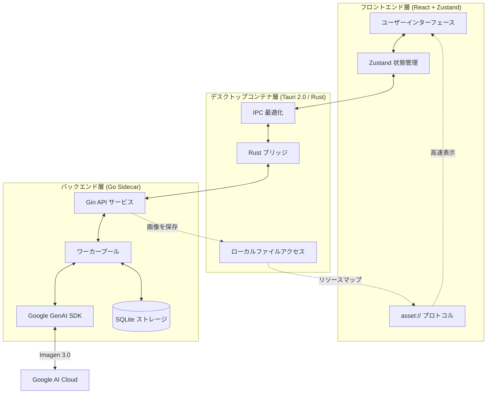

# 🎨 Banana Pro AI (Web & Desktop)

[](https://github.com/ShellMonster/Nano_Banana_Pro_Web/stargazers)
[](https://github.com/ShellMonster/Nano_Banana_Pro_Web/blob/main/LICENSE)
[](https://github.com/ShellMonster/Nano_Banana_Pro_Web/releases)


[English](README_EN.md) | [简体中文](README.md) | [日本語](README_JP.md) | [한국어](README_KR.md)

**Banana Pro AI** は、クリエイター向けに設計された高性能な画像生成プラットフォームです。Gemini と OpenAI の標準 API 機能を統合し、高解像度（最大 4K）の Text-to-Image（文生図）および Image-to-Image（図生図）をサポート。デスクトップ版と Web 版の両方を提供しています。

> [!NOTE]
> **アプリ内は日本語に対応しており、設定から言語を切り替えて使用することができます。**

<p align="center">
  
  <br>
  
  <br>
  
</p>

> 💡 **最近のアップデートのハイライト**:
> - **✨ OpenAI 標準 API 統合**: プロンプト最適化と画像生成の両方で、Gemini / OpenAI 互換インターフェースの切り替えが可能に。
> - **🤖 プロンプト最適化の強化**: 新しい **JSON モード** ボタンを追加。構造化された JSON 出力を強制し、自動フォーマットとバックフィルをサポートしてプロンプトの質を向上。
> - **🧵 テンプレートマーケット**: プルダウン操作で全画面のテンプレートマーケットを展開。フィルタリング、プレビュー、ソース追跡、使用のヒントをサポートし、ワンクリックで適用可能。
> - **🚀 パフォーマンスの最適化**: 履歴記録とテンプレートマーケットを仮想リスト/グリッドに移行し、画像読み込みをよりスムーズに。
> - **🖼️ 画像なしテンプレートのサポート**: プレビュー画像がないテンプレートでも、デフォルトのプレースホルダーを表示し、プロンプトの再利用が可能。

> 💡 **推奨**: 最高の生成体験とコストパフォーマンスを得るために、[Yunwu API](https://yunwu.ai/register?aff=i4hh) の使用をお勧めします。
>
> | 生成解像度 | [Yunwu API](https://yunwu.ai/register?aff=i4hh) 価格 | [Google 公式価格 (参考)](https://ai.google.dev/gemini-api/docs/pricing?hl=zh-cn#gemini-3-pro-image-preview) |
> | :--- | :--- | :--- |
> | **1K** (1024x1024) | **¥0.08 / 枚** | ≈ ¥0.94 / 枚 |
> | **2K** (2048x2048) | **¥0.08 / 枚** | ≈ ¥0.94 / 枚 |
> | **4K** (4096x4096) | **¥0.14 / 枚** | ≈ ¥1.68 / 枚 |

---

## 🌟 主な特徴

- **🚀 究極のパフォーマンス**: **Tauri 2.0** アーキテクチャと、**Go 言語**で記述された高並列 Sidecar バックエンドを採用し、極めて低いリソース消費を実現。
- **🖼️ 4K 超高画質創作**: Gemini 3.0 モデルを深く最適化し、複数のアスペクト比で 4K UHD 画像生成をサポート。
- **🔌 標準 API 互換**: Gemini (/v1beta) および OpenAI (/v1) の標準フォーマットをサポートし、Base URL とモデル ID を構成可能。
- **⚡ カスタムプロトコル (asset://)**: デスクトップ向けにネイティブのリソースプロトコルを登録。HTTP スタックをバイパスし、ローカル画像の読み込み速度を 300% 向上。
- **💾 スマートな履歴管理**: ローカルデータベースと永続化キャッシュを内蔵。タスクの自動回復と大量の履歴記録の即時表示をサポート。
- **📸 精密な Image-to-Image**: 複数の参照画像をサポートし、繊細なスタイルと構図のコントロールを提供。
- **📦 自動デリバリー**: GitHub Actions を統合し、macOS (Intel/M1) および Windows プラットフォーム向けの自動パッケージングとリリースを実現。
- **🧩 テンプレートマーケット**: 起動時にリモートのテンプレート JSON を優先的に取得し、失敗した場合は内蔵テンプレートに自動フォールバック。

---

## 🚀 機能の詳細

### 1. インテリジェントな Text-to-Image
- **正確な意味理解**: Google Gemini 3.0 と深く統合し、プロンプトの細部、スタイル、雰囲気を正確にキャプチャ。
- **AI プロンプト最適化**: Gemini / OpenAI 標準インターフェースを介した最適化エンジンを内蔵。
- **履歴管理**: 無制限の元に戻す/やり直しをサポートし、クリエイティブなアイデア間を素早く切り替え。
- **バッチ生成**: 一度に最大 100 枚の画像生成を設定でき、バックグラウンドで自動的にキュー処理されます。
- **リアルタイム進捗追跡**: 明確なプログレスバーとステータス表示を提供。生成中の各画像にはプレースホルダーカードが表示され、完了後に自動更新されます。

### 2. 強力な Image-to-Image
- **マルチリファレンス対応**: 最大 10 枚の参照画像を追加でき、AI が構図やスタイルをより深く理解するのを支援。
- **柔軟なアップロード方式**: 
    - **クリック/ドラッグ**: ローカルフォルダから選択、または直接ドラッグ＆ドロップ。
    - **貼り付け対応**: Web やチャットツールから画像をコピーし、直接ソフトウェアに貼り付け可能。
- **スマートな前処理**: 巨大な画像の自動圧縮と MD5 による重複フィルタリング。

### 3. プロフェッショナルなパラメータ制御
- **多彩なアスペクト比**: 1:1, 16:9, 9:16, 4:3, 2:3 などの主要な比率をプリセット。
- **画質カスタマイズ**: 1K から 4K までの超高解像度設定をサポート。
- **スマートサイズ適応**: モデルの特性に合わせて画像サイズを最適なピクセル（8の倍数）に自動調整し、生成効果を最適化。
- **インターフェース切り替え**: 設定で `Gemini(/v1beta)` または `OpenAI(/v1)` を選択し、それぞれの Base URL / API Key / モデル ID を構成可能。

### 4. 究極のインタラクションと管理
- **没入型プレビュー**: 全画面での画像確認、自由なズームとドラッグ機能をサポート。
- **高密度 UI デザイン**: 生産性向上のために最適化。設定パネルの高さ自動調整など、情報をコンパクトに表示。
- **ワンクリック操作**:
    - **クイックコピー**: プレビュー画面に「画像をコピー」ボタンを配置し、他アプリへ即座に貼り付け可能。
    - **一括管理**: 複数画像を選択しての一括保存や削除をサポート。
- **スマートな永続化**: サイドバーの状態、ウィンドウ位置、最後に使用したモデル設定を自動的に記憶。

### 5. タスクと履歴記録
- **完全自動永続化**: すべての生成記録をローカルデータベースにリアルタイム保存。再起動後もデータは失われません。
- **スマート検索**: キーワードで過去のタスクを素早く検索可能。
- **安定した接続**: WebSocket と HTTP ポーリングモードを自動切り替えし、複雑なネットワーク環境下でもタスクを中断させません。

### 6. テンプレートマーケット (Template Market)
- **豊富なリソース**: 現在 900 以上の高品質テンプレートを収録。
- **プルダウン起動**: 上部の「ロープ」を引くアクションで、全画面のマーケットを展開。
- **多次元フィルタリング**: 検索、チャンネル、素材、業界、アスペクト比での絞り込みに対応。
- **PPT カテゴリ**: 16:9 のテンプレートを集中表示し、プレゼン資料作成を支援。
- **ワンクリック再利用**: テンプレートをプレビューして直接適用可能（現在のプロンプトと参照画像を置換）。
- **手動更新**: 更新ボタンで最新のテンプレートを手動取得。
- **ソースとヒント**: `tips`（使用のコツ）と `source`（出典、外部ブラウザへジャンプ可）情報を表示。
- **参照要件**: `minRefs`（最小参照数）や `note`（説明）を表示し、必要な画像入力をガイド。
- **リモート同期**: 起動時に GitHub Raw から最新 JSON を取得し、失敗時はローカルキャッシュを使用。

---

## 🧩 テンプレート貢献指南

テンプレートデータは以下で一括管理されています：
- `backend/internal/templates/assets/templates.json`

### トップレベル構造
```json
{
  "meta": {
    "version": "2024.12.01",
    "updated_at": "2024-12-01T12:00:00Z",
    "channels": ["コミュニティ", "SNS", "小紅書"],
    "materials": ["ポスター", "PPT", "カバー"],
    "industries": ["教育", "生活サービス"],
    "ratios": ["1:1", "3:4", "16:9"]
  },
  "items": []
}
```

### 基本フィールド（単一テンプレート）
```json
{
  "id": "tpl-001",
  "title": "猫のミームテンプレート",
  "channels": ["コミュニティ", "エンタメ"],
  "materials": ["ポスター"],
  "industries": ["生活サービス"],
  "ratio": "1:1",
  "preview": "https://.../thumb.jpg",
  "image": "https://.../full.jpg",
  "prompt": "任意：テンプレートプロンプト...",
  "prompt_params": "任意：プロンプト使用説明（予約済み）",
  "tips": "任意：使用のコツ/テクニック",
  "source": {
    "name": "@貢献者",
    "label": "GitHub",
    "icon": "github",
    "url": "https://example.com/templates/tpl-001"
  },
  "requirements": { "minRefs": 2, "note": "参照として猫の写真が1枚必要です" },
  "tags": ["猫", "ミーム", "面白い"]
}
```

### フィールド補足説明
- `requirements.note`: 参照画像が必要な際のガイド文。
- `requirements.minRefs`: 必要な最小参照画像数。
- `tips`: 使用テクニックや注意事項。
- `prompt_params`: 予約済みフィールド（現在はレンダリングされません）。
- `tags`: 検索や集計に使用。
- `materials`: `PPT` タグを追加可能（16:9 推奨）。
- `meta.version / meta.updated_at`: バージョン管理とキャッシュ比較用。

### source.icon プリセット
- `github`, `xhs`, `wechat`, `shop`, `video`, `print`, `gov`, `meme`, `finance`, `food`, `local`.

---

## 🏗️ 技術アーキテクチャ

### コアシステムフロー


本プロジェクトは、パフォーマンスと拡張性のバランスを確保するために「3層アーキテクチャ」を採用しています：
1. **フロントエンド (React + Zustand)**: レスポンシブな UI と状態管理を担当。
2. **デスクトップコンテナ (Tauri)**: Rust ブリッジとしてウィンドウ制御やローカルリソースアクセスを処理。
3. **推論エンジン (Go Sidecar)**: Google GenAI SDK との通信、タスクプール、ローカルストレージを管理。

### 主な最適化ポイント
- **IPC 負荷最適化**: フロントエンドとバックエンド間ではファイルパスのみを渡し、大きなバイナリデータは `asset://` プロトコルを介して直接読み込みます。
- **プロセス寿命管理**: Tauri 終了時に Go サイドカープロセスを自動的にクリーンアップし、リソース漏洩を防止します。

---

## 📂 プロジェクト構造

```bash
├── backend/            # Go 言語で記述された推論バックエンド (Sidecar)
│   ├── cmd/server/     # サービスエントリポイント
│   └── internal/       # コアロジック (Gemini アダプタ、ワーカープール、DB)
├── desktop/            # Tauri デスクトッププロジェクト (React + Rust)
│   ├── src/            # フロントエンドコンポーネントとビジネスロジック
│   └── src-tauri/      # Rust コンテナ構成とシステム権限定義
├── frontend/           # 独立した Web 版フロントエンド (参考用)
└── assets/             # プロジェクト展示リソース (プレビュー画像など)
```

---

## 💻 開発者ガイド

### 1. 環境準備
- **Go**: 1.21+
- **Node.js**: 18+ (20推奨)
- **Rust**: 1.75+ (Tauri のビルドに必要)

### 🍎 macOS の起動エラー
一部の macOS ユーザーで、Gatekeeper の影響により開けない場合があります。ターミナルで以下を実行してください：
```bash
sudo xattr -r -d com.apple.quarantine "/Applications/Banana Pro AI.app"
```

### 2. バックエンド開発
```bash
cd backend
# config.yaml をコピーして API Key を設定
go run cmd/server/main.go
```
または Makefile を使用：
```bash
make build    # バックエンドをビルド
make run      # バックエンドを実行
```

### 3. デスクトップ版開発
```bash
cd desktop
npm install
npm run tauri dev
```

### 4. Web フロントエンド開発
```bash
cd frontend
npm install
npm run dev
```

### 5. 自動ビルド (GitHub Actions)
バージョンタグ（例: `v1.3.0`）をプッシュすると自動ビルドがトリガーされます：
```bash
git tag v1.3.0
git push origin v1.3.0
```

### 6. 自動更新 (Updater)
Tauri 公式の Updater 機能を統合済みです。
1. 署名鍵の生成: `npm run tauri signer generate -- -w ~/.tauri/banana-updater.key`
2. 公開鍵を `tauri.conf.json` に設定。
3. GitHub Secrets を設定して CI で署名を有効化。

---

## ⚙️ 核心構成

| 項目 | 説明 |
| :--- | :--- |
| `AI モード` | `Gemini(/v1beta)` または `OpenAI(/v1)`。 |
| `API Base / Key` | 標準的な OpenAI 形式の互換インターフェース。 |
| `Storage Dir` | 画像の保存先。デフォルトはシステムの `AppData` (Win) または `Application Support` (Mac)。 |
| `Templates Remote URL` | 遠隔テンプレート JSON アドレス（デフォルトは GitHub Raw）。 |
| `asset://` | ローカル画像に高速・安全にアクセスするためのカスタムプロトコル。 |

---

## 🐳 Docker デプロイ (Web版)

デスクトップ版は Docker に適していません。以下は **バックエンド + Web フロントエンド** のデプロイ用です。

### クイックスタート

```bash
# 1. 環境変数テンプレートをコピーして API Key を設定
cp .env.example .env
nano .env  # GEMINI_API_KEY または OPENAI_API_KEY を追加

# 2. サービスを起動 (docker compose を使用)
docker compose -p banana-pro up -d

# 3. アプリケーションにアクセス
# ブラウザ: http://localhost:8090
```

### 詳細ドキュメント

完全なデプロイガイド、設定、トラブルシューティングについては: **[DOCKER_DEPLOY.md](DOCKER_DEPLOY.md)**

### 主な機能

- 🐳 **マルチステージビルド**: フロントエンド (Node.js) + バックエンド (Go) + ランタイム (Alpine + Nginx)
- 🚀 **環境自動検出**: バックエンドは Docker を自動検出し `0.0.0.0` でリッスン (Tauri は `127.0.0.1`)
- 💾 **データ永続化**: 画像とデータベースは自動的に `./data/storage` にマウント
- 🔄 **ヘルスチェック**: 組み込みヘルスエンドポイントと自動再起動
- 🇨🇳 **ミラーサポート**: Build Args で設定可能な中国ミラーソース

---

## 🤝 貢献とフィードバック

あらゆる形式の貢献を歓迎します！

- **バグ報告**: GitHub Issue を通じて詳細な再現手順を提供してください。
- **PR 提出**: 既存のコードスタイルに従い、十分にテストを行ってください。

---

## 📄 ライセンス

本プロジェクトは [MIT License](LICENSE) の下で公開されています。

---

## 📈 Star History

[](https://star-history.com/#ShellMonster/Nano_Banana_Pro_Web&Date)

---

## 🙏 特別な感謝

- 多くのテンプレートは [awesome-nanobananapro-prompts](https://github.com/xianyu110/awesome-nanobananapro-prompts) のプロンプトを再利用しています。
- JSON プロンプト最適化ロジックは [fofr](https://gist.github.com/fofr/eec0dae326243321c645aceba28c6119) からインスピレーションを得ています。
