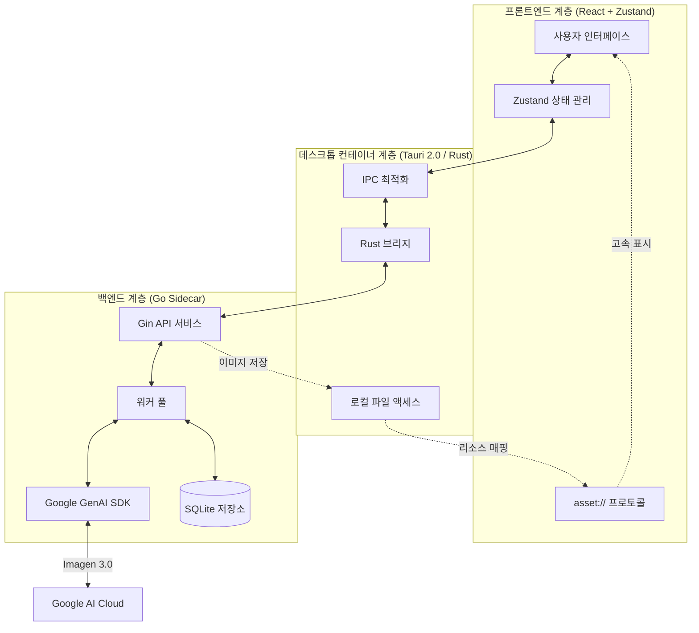

# 🎨 Banana Pro AI (Web & Desktop)

[](https://github.com/ShellMonster/Nano_Banana_Pro_Web/stargazers)
[](https://github.com/ShellMonster/Nano_Banana_Pro_Web/blob/main/LICENSE)
[](https://github.com/ShellMonster/Nano_Banana_Pro_Web/releases)


[English](README_EN.md) | [简体中文](README.md) | [日本語](README_JP.md) | [한국어](README_KR.md)

**Banana Pro AI**는 크리에이티브 전문가를 위해 설계된 고성능 이미지 생성 플랫폼입니다. Gemini와 OpenAI 표준 API 기능을 통합하여 고해상도(최대 4K)의 Text-to-Image 및 Image-to-Image 생성을 지원하며, 데스크톱과 웹 두 가지 형태를 제공합니다.

> [!NOTE]
> **앱 내에서 한국어를 지원하며, 설정에서 언어를 변경하여 사용할 수 있습니다.**

<p align="center">
  
  <br>
  
  <br>
  
</p>

> 💡 **최근 업데이트 하이라이트**:
> - **✨ OpenAI 표준 API 통합**: 프롬프트 최적화 및 이미지 생성 모두에서 Gemini / OpenAI 호환 인터페이스를 전환하여 사용 가능.
> - **🤖 프롬프트 최적화 강화**: 새로운 **JSON 모드** 버튼 추가. 구조화된 JSON 출력을 강제하고 자동 포맷팅 및 백필을 지원하여 프롬프트 품질 향상.
> - **🧵 템플릿 마켓**: 풀다운 조작으로 전체 화면 템플릿 마켓 전개. 필터링, 미리보기, 출처 추적 및 사용 팁을 지원하며 원클릭 적용 가능.
> - **🚀 성능 최적화**: 기록 및 템플릿 마켓을 가상 리스트/그리드로 마이그레이션하여 이미지 로딩을 더욱 부드럽게 개선.
> - **🖼️ 이미지 없는 템플릿 지원**: 미리보기 이미지가 없는 템플릿도 기본 플레이스홀더를 표시하며 프롬프트 재사용 가능.

> 💡 **추천**: 최고의 생성 경험과 가성비를 위해 [Yunwu API](https://yunwu.ai/register?aff=i4hh) 사용을 권장합니다.
>
> | 생성 해상도 | [Yunwu API](https://yunwu.ai/register?aff=i4hh) 가격 | [Google 공식 가격 (참고)](https://ai.google.dev/gemini-api/docs/pricing?hl=zh-cn#gemini-3-pro-image-preview) |
> | :--- | :--- | :--- |
> | **1K** (1024x1024) | **약 15원 / 장** | ≈ 170원 / 장 |
> | **2K** (2048x2048) | **약 15원 / 장** | ≈ 170원 / 장 |
> | **4K** (4096x4096) | **약 26원 / 장** | ≈ 300원 / 장 |

---

## 🌟 주요 특징

- **🚀 극한의 성능**: **Tauri 2.0** 아키텍처와 **Go 언어**로 작성된 고성능 Sidecar 백엔드를 채택하여 리소스 소모를 최소화.
- **🖼️ 4K 초고화질 창작**: Gemini 3.0 모델을 최적화하여 다양한 종횡비에서 4K UHD 이미지 생성 지원.
- **🔌 표준 API 호환**: Gemini (/v1beta) 및 OpenAI (/v1) 표준 포맷을 지원하며 Base URL 및 모델 ID 설정 가능.
- **⚡ 커스텀 프로토콜 (asset://)**: 데스크톱용 네이티브 리소스 프로토콜 등록. HTTP 스택을 우회하여 로컬 이미지 로딩 속도 300% 향상.
- **💾 스마트 기록 관리**: 로컬 데이터베이스 및 영속성 캐시 내장. 작업 자동 복구 및 대량의 기록 즉시 탐색 지원.
- **📸 정밀한 Image-to-Image**: 여러 참조 이미지를 지원하며 섬세한 스타일 및 구도 제어 기능 제공.
- **📦 자동 배포**: GitHub Actions를 통합하여 macOS (Intel/M1) 및 Windows용 자동 패키징 및 릴리스 구현.
- **🧩 템플릿 마켓**: 시작 시 원격 템플릿 JSON을 우선적으로 가져오며 실패 시 내장 템플릿으로 자동 전환.

---

## 🚀 상세 기능

### 1. 스마트 Text-to-Image
- **정밀한 의미 이해**: Google Gemini 3.0과 긴밀하게 통합되어 프롬프트의 세부 사항, 스타일 및 분위기를 정확하게 포착.
- **AI 프롬프트 최적화**: Gemini / OpenAI 표준 인터페이스를 통한 최적화 엔진 내장.
- **편집 기록 관리**: 무제한 실행 취소/다시 실행을 지원하여 다양한 아이디어 간 빠른 전환 가능.
- **일괄 동시 생성**: 한 번에 최대 100장의 이미지 생성을 설정할 수 있으며, 백그라운드에서 자동으로 큐 처리가 이루어집니다.
- **실시간 진행 추적**: 명확한 진행 표시줄과 상태 표시를 제공합니다. 생성 중인 각 이미지에는 자리 표시자 카드가 표시되며, 완료 후 자동으로 업데이트됩니다.

### 2. 강력한 Image-to-Image
- **멀티 참조 지원**: 최대 10개의 참조 이미지를 추가하여 AI가 구도나 스타일을 더 잘 이해하도록 지원.
- **유연한 업로드 방식**: 
    - **클릭/드래그**: 로컬 폴더에서 선택하거나 직접 드래그 앤 드롭.
    - **붙여넣기 지원**: 웹이나 채팅 도구에서 이미지를 복사하여 소프트웨어에 직접 붙여넣기 가능.
- **스마트 전처리**: 대용량 이미지 자동 압축 및 MD5 기반 중복 필터링.

### 3. 전문가급 파라미터 제어
- **다양한 종횡비**: 1:1, 16:9, 9:16, 4:3, 2:3 등 주요 비율 프리셋 제공.
- **화질 사용자 정의**: 1K에서 4K까지 초고해상도 설정 지원.
- **스마트 크기 맞춤**: 모델 특성에 맞춰 이미지 크기를 최적의 픽셀(8의 배수)로 자동 조정하여 생성 효과 최적화.
- **인터페이스 전환**: 설정에서 `Gemini(/v1beta)` 또는 `OpenAI(/v1)`를 선택하고 각각의 Base URL / API Key / 모델 ID를 구성 가능.

### 4. 최고의 상호작용 및 관리
- **몰입형 미리보기**: 전체 화면 이미지 확인, 자유로운 확대/축소 및 드래그 기능 지원.
- **고밀도 UI 디자인**: 생산성 향상을 위해 최적화. 설정 패널 높이 자동 조정 등 정보를 콤팩트하게 표시.
- **원클릭 빠른 작업**:
    - **빠른 복사**: 미리보기 화면에 '이미지 복사' 버튼을 배치하여 다른 앱으로 즉시 붙여넣기 가능.
    - **일괄 관리**: 여러 이미지를 선택하여 일괄 저장 또는 삭제 지원.
- **스마트 영속성**: 사이드바 상태, 창 위치, 마지막으로 사용한 모델 설정을 자동으로 기억.

### 5. 작업 및 히스토리 기록
- **완전 자동 영속화**: 모든 생성 기록을 로컬 데이터베이스에 실시간 저장. 재시작 후에도 데이터가 유지됩니다.
- **스마트 검색**: 키워드로 과거 작업을 빠르게 검색 가능.
- **안정적인 연결**: WebSocket과 HTTP 폴링 모드를 자동 전환하여 복잡한 네트워크 환경에서도 작업이 중단되지 않도록 보장.

### 6. 템플릿 마켓 (Template Market)
- **방대한 리소스**: 현재 900개 이상의 고품질 템플릿 수록.
- **풀다운 실행**: 상단의 '로프'를 당기는 액션으로 전체 화면 마켓 전개.
- **다차원 필터링**: 검색, 채널, 소재, 산업, 종횡비별 필터링 지원.
- **PPT 카테고리**: 16:9 템플릿을 집중 표시하여 발표 자료 제작 지원.
- **원클릭 재사용**: 템플릿 미리보기 후 즉시 적용 가능 (현재 프롬프트와 참조 이미지 교체).
- **수동 업데이트**: 업데이트 버튼으로 최신 템플릿 수동 가져오기.
- **출처 및 팁**: `tips`(사용 팁)와 `source`(출처, 외부 브라우저 이동 가능) 정보 표시.
- **참조 요구사항**: `minRefs`(최소 참조 수) 및 `note`(설명)를 표시하여 필요한 이미지 입력 가이드.
- **원격 동기화**: 시작 시 GitHub Raw에서 최신 JSON을 가져오며 실패 시 로컬 캐시 사용.

---

## 🧩 템플릿 기여 가이드

템플릿 데이터는 다음에서 통합 관리됩니다:
- `backend/internal/templates/assets/templates.json`

### 최상위 구조
```json
{
  "meta": {
    "version": "2024.12.01",
    "updated_at": "2024-12-01T12:00:00Z",
    "channels": ["커뮤니티", "SNS", "샤오홍슈"],
    "materials": ["포스터", "PPT", "커버"],
    "industries": ["교육", "생활 서비스"],
    "ratios": ["1:1", "3:4", "16:9"]
  },
  "items": []
}
```

### 기본 필드 (단일 템플릿)
```json
{
  "id": "tpl-001",
  "title": "고양이 밈 템플릿",
  "channels": ["커뮤니티", "엔터테인먼트"],
  "materials": ["포스터"],
  "industries": ["생활 서비스"],
  "ratio": "1:1",
  "preview": "https://.../thumb.jpg",
  "image": "https://.../full.jpg",
  "prompt": "선택: 템플릿 프롬프트...",
  "prompt_params": "선택: 프롬프트 사용 설명 (예약어)",
  "tips": "선택: 사용 팁/노하우",
  "source": {
    "name": "@기여자",
    "label": "GitHub",
    "icon": "github",
    "url": "https://example.com/templates/tpl-001"
  },
  "requirements": { "minRefs": 2, "note": "참조용 고양이 사진 1장이 필요합니다" },
  "tags": ["고양이", "밈", "웃긴"]
}
```

### 필드 보충 설명
- `requirements.note`: 참조 이미지가 필요할 때 표시되는 안내 문구.
- `requirements.minRefs`: 필요한 최소 참조 이미지 수.
- `tips`: 사용 노하우 및 주의 사항.
- `prompt_params`: 예약된 필드 (현재 렌더링되지 않음).
- `tags`: 검색 및 집계에 사용.
- `materials`: `PPT` 태그 추가 가능 (16:9 권장).
- `meta.version / meta.updated_at`: 버전 관리 및 캐시 비교용.

### source.icon 프리셋
- `github`, `xhs`, `wechat`, `shop`, `video`, `print`, `gov`, `meme`, `finance`, `food`, `local`.

---

## 🏗️ 기술 아키텍처

### 핵심 시스템 흐름


본 프로젝트는 성능과 확장성의 균형을 위해 '3계층 아키텍처'를 채택했습니다:
1. **프론트엔드 (React + Zustand)**: 반응형 UI와 상태 관리 담당.
2. **데스크톱 컨테이너 (Tauri)**: Rust 브리지로서 창 제어 및 로컬 리소스 액세스 처리.
3. **추론 엔진 (Go Sidecar)**: Google GenAI SDK 통신, 작업 풀, 로컬 스토리지 관리.

### 주요 최적화 포인트
- **IPC 부하 최적화**: 프론트엔드와 백엔드 간에는 파일 경로만 전달하며, 대용량 바이너리 데이터는 `asset://` 프로토콜을 통해 직접 읽어옵니다.
- **프로세스 수명 관리**: Tauri 종료 시 Go 사이드카 프로세스를 자동으로 정리하여 리소스 누수를 방지합니다.

---

## 📂 프로젝트 구조

```bash
├── backend/            # Go 언어로 작성된 추론 백엔드 (Sidecar)
│   ├── cmd/server/     # 서비스 엔트리 포인트
│   └── internal/       # 핵심 로직 (Gemini 어댑터, 워커 풀, DB)
├── desktop/            # Tauri 데스크톱 프로젝트 (React + Rust)
│   ├── src/            # 프론트엔드 컴포넌트 및 비즈니스 로직
│   └── src-tauri/      # Rust 컨테이너 구성 및 시스템 권한 정의
├── frontend/           # 독립된 웹 버전 프론트엔드 (참고용)
└── assets/             # 프로젝트 전시 리소스 (미리보기 이미지 등)
```

---

## 💻 개발자 가이드

### 1. 환경 준비
- **Go**: 1.21+
- **Node.js**: 18+ (20 권장)
- **Rust**: 1.75+ (Tauri 빌드에 필요)

### 🍎 macOS 실행 오류
일부 macOS 사용자의 경우 Gatekeeper 영향으로 열리지 않을 수 있습니다. 터미널에서 다음을 실행하십시오:
```bash
sudo xattr -r -d com.apple.quarantine "/Applications/Banana Pro AI.app"
```

### 2. 백엔드 개발
```bash
cd backend
# config.yaml을 복사하여 API Key 설정
go run cmd/server/main.go
```
또는 Makefile 사용:
```bash
make build    # 백엔드 빌드
make run      # 백엔드 실행
```

### 3. 데스크톱 버전 개발
```bash
cd desktop
npm install
npm run tauri dev
```

### 4. 웹 프론트엔드 개발
```bash
cd frontend
npm install
npm run dev
```

### 5. 자동 빌드 (GitHub Actions)
버전 태그(예: `v1.3.0`)를 푸시하면 자동 빌드가 트리거됩니다:
```bash
git tag v1.3.0
git push origin v1.3.0
```

### 6. 자동 업데이트 (Updater)
Tauri 공식 Updater 기능을 통합했습니다.
1. 서명 키 생성: `npm run tauri signer generate -- -w ~/.tauri/banana-updater.key`
2. 공개 키를 `tauri.conf.json`에 설정.
3. GitHub Secrets를 설정하여 CI에서 서명 활성화.

---

## ⚙️ 핵심 설정

| 항목 | 설명 |
| :--- | :--- |
| `AI 모드` | `Gemini(/v1beta)` 또는 `OpenAI(/v1)`. |
| `API Base / Key` | 표준 OpenAI 형식의 호환 인터페이스. |
| `Storage Dir` | 이미지 저장 경로. 기본값은 시스템의 `AppData` (Win) 또는 `Application Support` (Mac). |
| `Templates Remote URL` | 원격 템플릿 JSON 주소 (기본값 GitHub Raw). |
| `asset://` | 로컬 이미지에 빠르고 안전하게 액세스하기 위한 커스텀 프로토콜. |

---

## 🐳 Docker 배포 (웹 버전)

데스크톱 버전은 Docker에 적합하지 않습니다. 다음은 **백엔드 + 웹 프론트엔드** 배포용입니다.

### 빠른 시작

```bash
# 1. 환경변수 템플릿을 복사하고 API Key 설정
cp .env.example .env
nano .env  # GEMINI_API_KEY 또는 OPENAI_API_KEY 추가

# 2. 서비스 시작 (docker compose 사용)
docker compose -p banana-pro up -d

# 3. 애플리케이션 접속
# 브라우저: http://localhost:8090
```

### 상세 문서

전체 배포 가이드, 설정, 문제 해결은: **[DOCKER_DEPLOY.md](DOCKER_DEPLOY.md)**

### 주요 기능

- 🐳 **멀티스테이지 빌드**: 프론트엔드 (Node.js) + 백엔드 (Go) + 런타임 (Alpine + Nginx)
- 🚀 **환경 자동 감지**: 백엔드는 Docker를 자동 감지하여 `0.0.0.0`에서 리스닝 (Tauri는 `127.0.0.1`)
- 💾 **데이터 지속성**: 이미지와 데이터베이스는 자동으로 `./data/storage`에 마운트
- 🔄 **헬스 체크**: 내장된 헬스 엔드포인트와 자동 재시작
- 🇨🇳 **미러 지원**: Build Args로 구성 가능한 중국 미러 소스

---

## 🤝 기여 및 피드백

어떠한 형태의 기여도 환영합니다!

- **버그 보고**: GitHub Issue를 통해 상세한 재현 단계와 시스템 환경을 제공해 주세요.
- **PR 제출**: 기존 코드 스타일을 준수하고 제출 전 충분히 테스트해 주세요.

---

## 📄 라이선스

이 프로젝트는 [MIT License](LICENSE) 하에 공개되어 있습니다.

---

## 📈 Star History

[](https://star-history.com/#ShellMonster/Nano_Banana_Pro_Web&Date)

---

## 🙏 특별한 감사

- 많은 템플릿은 [awesome-nanobananapro-prompts](https://github.com/xianyu110/awesome-nanobananapro-prompts)의 프롬프트를 재사용합니다.
- JSON 프롬프트 최적화 로직은 [fofr](https://gist.github.com/fofr/eec0dae326243321c645aceba28c6119)에서 영감을 얻었습니다.
   372→
